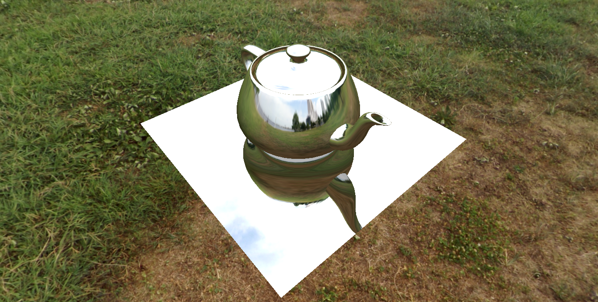

# OpenGL - Interactive Computer Graphics 🎮🌌

[](https://opensource.org/licenses/MIT)

This repository contains an OpenGL application that showcases various techniques and concepts in computer graphics. The project implemented here is called "Environment Mapping," which focuses on creating surfaces with high reflectivity using frame buffers and render-to-texture techniques. The project features a reflective teapot and a plane underneath that reflects the teapot's appearance.


## Course - Interactive Computer Graphics 🧠

This project is based on the concepts learned in the "Interactive Computer Graphics" course. The course provides a comprehensive understanding of interactive and real-time rendering, covering topics directly relevant to applications displaying 3D information, including video games and interactive visualization.

You can find the course materials and lectures [here](https://graphics.cs.utah.edu/courses/cs6610/spring2021/). Additionally, you can access the course lectures on YouTube through the [playlist](https://www.youtube.com/playlist?list=PLplnkTzzqsZS3R5DjmCQsqupu43oS9CFN).

Please refer to the course materials and YouTube playlist for a more in-depth understanding of the covered concepts.

## Future Projects 🔮🚀

This repository will be expanded with the following projects from the "Interactive Computer Graphics" course:

### Project - Shadow Mapping 🌑🌳

The "Shadow Mapping" project will explore the implementation of real-time shadow effects using shadow maps. It will demonstrate the ability to render shadows cast by objects in a scene, enhancing the overall realism. This project will feature a scene with dynamic lighting and accurate shadow generation for objects.

### Project - Tessellation 🎨✨

The "Tessellation" project utilizes tessellation shaders to adjust geometric surface detail dynamically. It enhances visual quality and realism, providing smoother curves and intricate details. The project includes normal mapping, displacement mapping, and triangulation visualization.

Each project will be implemented as a standalone scene within the application.

## Implementation Details 💡🖥️

In the "Environment Mapping" project, I generated separate Vertex Buffer Objects (VBOs) for positions, normals, and texture coordinates, as well as an Element Buffer Object (EBO) for the teapot faces. These VBOs and EBO store the necessary data for the teapot.

Additionally, I utilized hash tables to efficiently generate and manage the VBOs, improving performance and memory usage. To enhance the loading process, I employed multi-threading techniques to load the images used in the skybox.

## Usage 🚀💻

To run the projects, follow these steps:

1. Make sure you have Visual Studio installed with the "Desktop development with C++" workload.

2. Clone this repository:

```bash
git clone https://github.com/murilo-oak/OpenGL-Interactive-Computer-Graphics.git
```

3. Navigate to the project directory:

```bash
cd OpenGL-Interactive-Computer-Graphics
```

4. Initialize and update the submodules:

```bash
git submodule init
git submodule update
```

5. Open the `Project1.sln` solution file with Visual Studio. If you're using a version of Visual Studio newer than 2019, you may need to perform a project migration. To migrate the project, follow the instructions provided by Visual Studio.

6. Press the **Play** button in Visual Studio to build and run the selected project.

7. **Interacting with the application**:
   - Left mouse button + drag: Zoom in/out by dragging the mouse forward or backward. 🖱️🔍
   - Right mouse button + drag: Rotate the view around the teapot. 🖱️🔄

   Feel free to explore the application and experiment with the interactive controls to navigate the scene.
## License 📄🔒

This project is licensed under the MIT License. For more information, please refer to the [LICENSE](LICENSE) file.

---

Feel free to explore the code and experiment with different computer graphics techniques using this repository. If you have any questions or need assistance, feel free to reach out. Your feedback is also welcome and can help improve the projects further.

Enjoy diving into the exciting world of OpenGL and computer graphics! 🌠🎮